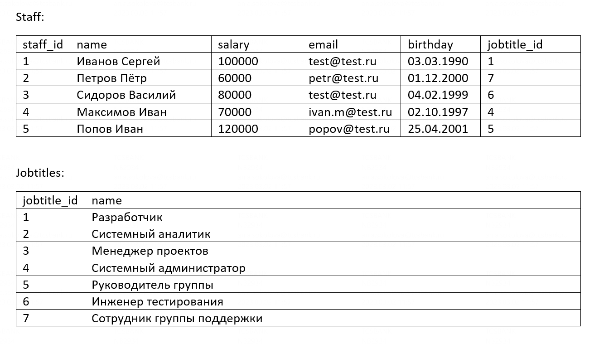

#  11. posgreSQL task

* Напишите запрос, с помощью которого можно найти дубли в поле email из таблицы Sfaff.

* Напишите запрос, с помощью которого можно определить возраст каждого сотрудника из таблицы Staff на момент запроса.

* Напишите запрос, с помощью которого можно определить должность (Jobtitles.name) со вторым по величине уровнем зарплаты.

В качестве ответа пришлите ссылку на файл (например, гугл-док) с написанными запросами. Не забудьте проверить, что файл открыт для чтения.