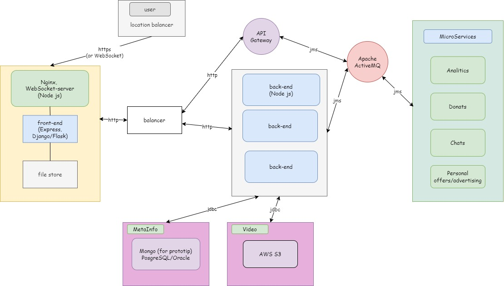

# Python-разработчик

Вам нужно спроектировать архитектуру любого высоконагруженного сервиса.

Вы можете придумать свой сервис или взять любой существующий (например, стриминговый
видео-сервис: ВК Клипы, ВК Реклама).
Главное требование: высокая нагрузка на сервис.

Формат сдачи: верхнеуровневая архитектура проекта с описанием технологий, протоколов и
систем хранения данных.

Можно нарисовать архитектуру от руки на листочке, в электронной схеме или оформить в виде:
структурированной презентации.

Ответом на это задание будет ссылка на фото, документ или презентацию в облаке/хранилище с
возможностью открыть его проверяющим.

В ходе собеседования мы с Вами обсудим фактуру решения.

# Предложеная архитектура  [(Ссылка на drawio)](https://drive.google.com/file/d/1vTFyQE4bhciVG3i0sEagwOdQb6FY9qtx/view?usp=sharing)

