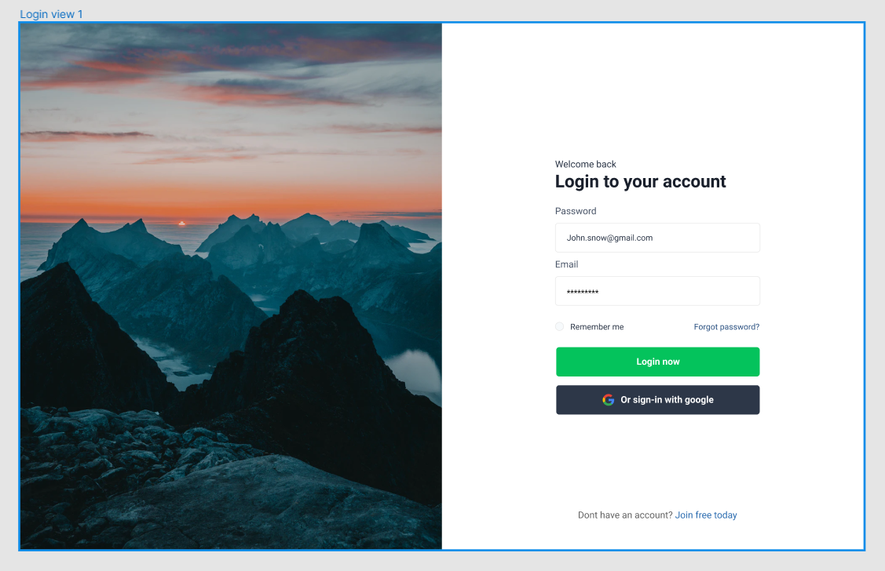

# Лабораторна работа №2. Базовая вёрстка login.

[Figma-maket](https://www.figma.com/file/JSdZ4zNfCpBxuXSxMkfK4g/Login-View-(Community)?node-id=0%3A1&t=7qNNiURFsM3Avf3S-0)

## Реальность 
[Ссылка на сайт - кликни по мне](https://pricolno.github.io/WorkForDemonstration/web-vk_univer/2_login/src/)

## Ожидание

